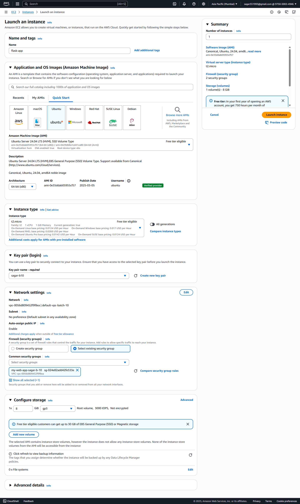
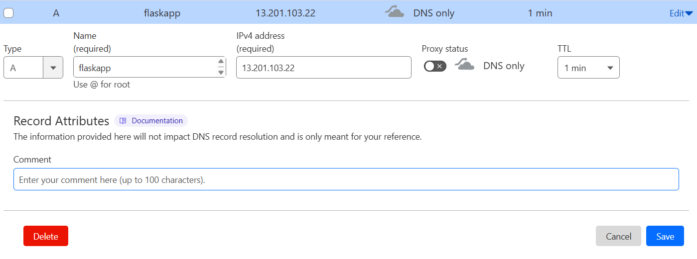
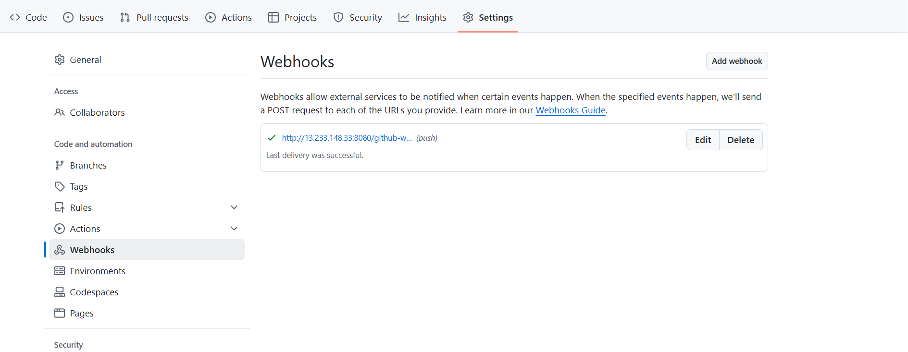
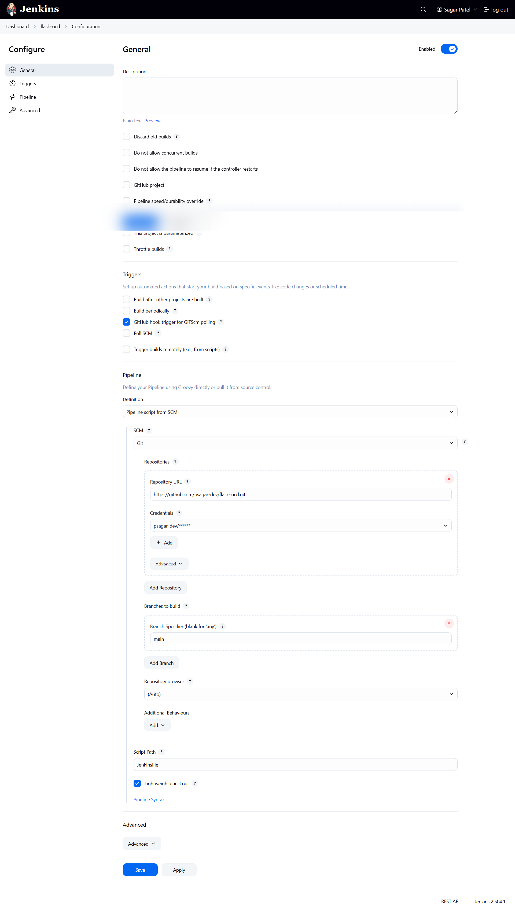
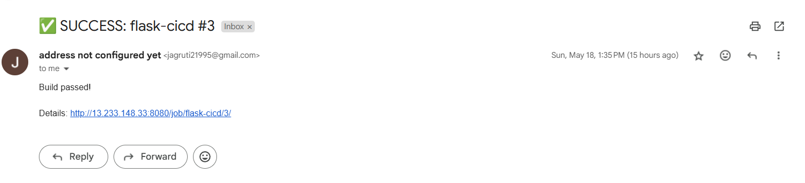
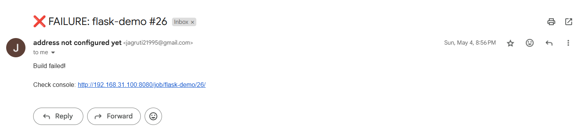
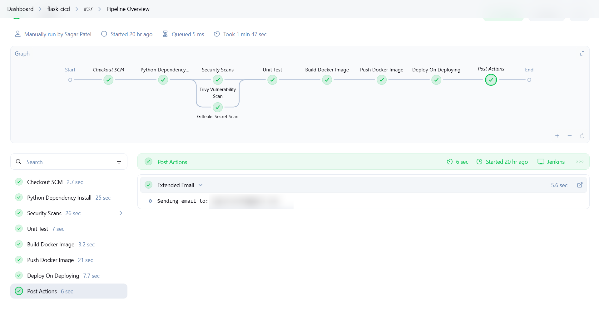
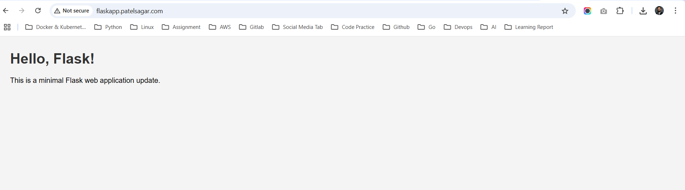

# 🛠️ Jenkins Setup & Pipeline Guide

You can [click here](https://github.com/psagar-dev/cheatsheet/blob/main/Jenkins/install.md) for more details on how to install Jenkins on Ubuntu.

---

## 🔧 Install Docker Engine

After opening the terminal, follow these steps:

- Install Docker
- Add your user to the Docker group
- Add the Jenkins user to the Docker group

```bash
sudo curl -fsSL https://get.docker.com | sudo sh

# Add Your User to the Docker Group
sudo usermod -aG docker $USER
newgrp docker

# Add Jenkins User to the Docker Group
sudo usermod -aG docker jenkins
newgrp docker

# Restart Jenkins if needed:
sudo systemctl restart jenkins
```

---

## 📦 Prerequisite Plugin Installation

Before proceeding with the pipeline setup or deployment process, ensure the following plugins are installed in your CI/CD environment (e.g., Jenkins).

### ✅ Required Plugins

| Plugin Name        | Purpose |
|--------------------|---------|
| **SSH Agent**      | Allows you to use SSH credentials to connect to remote servers during pipeline execution. |
| **Docker Pipeline**| Provides steps to build, run, and manage Docker containers as part of your pipeline. |

### 🔧 Installation Steps (Jenkins Example)

1. **Open Jenkins Dashboard**
2. Navigate to **Manage Jenkins > Manage Plugins**
3. Go to the **Available** tab
4. Search for the following plugins:
   - `SSH Agent`
   - `Docker Pipeline`
5. Select both plugins and click **Install without restart**
6. (Optional) Restart Jenkins if required

### 🧪 Verify Installation

1. Go to **Manage Jenkins > System Information**
2. Search for the plugin names to confirm they are listed and active.

---

## 🛠️ Shared Library Setup

To configure the global library in Jenkins:

1. Navigate to your Jenkins **Dashboard**.
2. Click on **Manage Jenkins**.
3. Select **System**.
4. Scroll down to the section labeled **Global Trusted Pipeline Libraries**.
5. Click **Add** and fill out the fields as follows:

### Library Configuration

| Field                        | Value                                                                 |
|-----------------------------|-----------------------------------------------------------------------|
| **Name**                    | `Shared`                                                              |
| **Default Version**         | `main` **(Branch name)**                                              |
| **Retrieval Method**        | `Modern SCM`                                                          |
| **Source Code Management**  | `Git`                                                                 |
| **Project Repository**      | `https://github.com/psagar-dev/jenkins-shared-libraries.git`          |
| **Credentials**             | `psagar-dev/******` *(Select your GitHub credentials if the repo is private)* |

Once the library is configured, you can load it in your `Jenkinsfile` using the following syntax:

```groovy
@Library('Shared') _
```

This will enable you to use the shared functions and utilities defined in the library across your Jenkins pipelines.

---

## 📨 Configure SMTP in Jenkins for Email Notifications

#### Jenkins Extended E-mail Notification Configuration

This configuration enables Jenkins to send emails using Gmail SMTP.

1. Navigate to your Jenkins **Dashboard**.
2. Click **Manage Jenkins**.
3. Select **System**.
4. Scroll down to **Extended E-mail Notification**.
5. Fill out the fields as follows:

#### SMTP Settings


| Setting      | Value               |
|--------------|---------------------|
| SMTP Server  | `smtp.gmail.com`    |
| SMTP Port    | `587`               |

### Advanced Settings

- **Credentials**: Set to a Gmail-based user with an app-specific password or a valid credential ID in Jenkins.
- **Use TLS**: ✅ *(Enabled)*

---

## 🔐 Credentials Setup (Required)

Please add the following credentials in Jenkins:

| Store  | Domain   | ID                | Name          | Functionality                      |
|--------|----------|-------------------|---------------|------------------------------------|
| System | (global) | Github            | ***** / ****** | Used for accessing GitHub repos in pipelines – [How to add this](https://github.com/psagar-dev/cheatsheet/blob/main/Jenkins/credentials-username-password.md) |
| System | (global) | gmail-smtp        | ***** / ****** | Sends notification emails via Gmail SMTP – [How to add this](https://github.com/psagar-dev/cheatsheet/blob/main/Jenkins/credentials-username-password.md) |
| System | (global) | docker-hub-creds  | ***** / ****** | Authenticates Docker Hub for image push/pull – [How to add this](https://github.com/psagar-dev/cheatsheet/blob/main/Jenkins/credentials-username-password.md) |
| System | (global) | ssh-ec2           | ubuntu         | SSH key to connect to EC2 instance – [How to add this](https://github.com/psagar-dev/cheatsheet/blob/main/Jenkins/credentials-ssh.md) |

---
### EC2 install Create



Then cloudflare add domain



---

## 🌍 Jenkins Global Environment Variables

This document outlines the global environment variables configured in Jenkins.

1. Navigate to your Jenkins **Dashboard**.
2. Click **Manage Jenkins**.
3. Select **System**.
4. Scroll down to **Global properties**.
5. Then click **Environment variables**.

### ✅ Global Properties Configuration

Environment variables are enabled globally.

### 📋 List of Environment Variables

| Name                    | Value               | Description                        |
|-------------------------|---------------------|------------------------------------|
| `FLASK_CICD_EC2_HOST`   | `52.66.137.64`      | Public IP of the EC2 instance      |
| `FLASK_CICD_EC2_USER`   | `ubuntu`            | Default SSH user for EC2 login     |
| `FLASK_EMAIL_RECIPIENTS`| `xxxxxxx@gmail.com` | Email recipient for notifications  |

---

## 🔧 Webhook Configuration in GitHub

### ✅ Step-by-Step: How to Add a GitHub Webhook

1. **Go to Your Repository**
   - Open your GitHub repository (e.g., `https://github.com/psagar-dev/flask-cicd`)
2. **Navigate to Webhooks**
   - Click on **Settings** (top bar)
   - In the left sidebar, click **Webhooks**
3. **Click “Add webhook”**
   - Button is located at the top-right of the Webhooks section
4. **Configure Webhook URL**
   - In the **Payload URL** field, enter the URL of your server that will receive the webhook (e.g., your Jenkins server or custom endpoint):
     ```
     http://your-server-ip-or-domain/github-webhook/
     ```
5. **Set Content Type**
   - Choose:
     ```
     application/json
     ```
6. **Select Events to Trigger**
   - Choose:
     - **Just the push event** *(common for CI/CD)*
7. **Activate the Webhook**
   - Make sure **"Active"** is checked
   - Click the **"Add webhook"** button
8. **Test the Webhook**
   - Push a commit or perform the selected event
   - Monitor the target server (Jenkins, etc.) or GitHub's webhook **Recent Deliveries** section



---

## 🚀 Jenkins Pipeline Configuration for `flask-cicd`

1. **Log in to Jenkins**
2. **Click on “New Item”**
   - This is usually located on the left-hand side of the Jenkins dashboard
3. **Enter a name for your job**
   - Example: `flask-cicd`
4. **Select “Pipeline” as the project type**
5. **Click “OK”**
   - This will take you to the configuration page for the new pipeline job

### 📁 Pipeline Definition

- **Definition**: Pipeline script from SCM
- **SCM**: Git
- **Repository URL**: `https://github.com/psagar-dev/flask-cicd.git`
- **Credentials**: `psagar-dev/******`
- **Branch Specifier**: `main`
- **Script Path**: `Jenkinsfile`

### ⚡ Trigger

- [x] GitHub hook trigger for GITScm polling 

### 📝 Notes

- This configuration uses a declarative pipeline stored in the `main` branch under the file `Jenkinsfile`.
- Ensure that the **GitHub webhook** is properly configured in your GitHub repository settings to trigger Jenkins jobs automatically.



---

# 📄 Jenkinsfile

📌 The shared library used in this pipeline:  
🔗 [jenkins-shared-libraries](https://github.com/psagar-dev/jenkins-shared-libraries)

```groovy
@Library('Shared') _
def config = securityConfig("securelooper/flask-cicd:${BUILD_NUMBER}",'flask-cicd-container')

pipeline {
    agent any
    
    stages {
        
        stage('Python Dependency Install') {
            agent {
                docker {
                    image 'python:3.13-slim'
                }
            }
            steps {
                installPythonDepsVm()
            }
        }

        stage("Security Scans") {
            steps {
                script {
                    securityScan()
                }
            }
        }
        
        stage('Unit Test') {
            agent {
                docker {
                    image 'python:3.13-slim'
                }
            }
            steps {
                unitTest()
            }
        }

        stage('Build Docker Image') {
            steps {
                script {
                    docker.build("${config.DOCKER_IMAGE}")
                }
            }
        }

        stage('Push Docker Image') {
            steps {
                script {
                    pushDockerImage("${config.DOCKER_IMAGE}", "${config.DOCKER_CREDENTIALS_ID}")
                }
            }
        }

        stage('Deploy On Deploying') {
            steps {
                 sshagent (credentials: ['ssh-ec2']) {
                    script {
                        remoteDockerDeploy(
                            "${config.DOCKER_IMAGE}",
                            "${config.CONTAINER_NAME}",
                            "80:5000",
                            "ssh-ec2"
                        )
                    }
                 }
            }
        }
    }

    post {
        success {
            script {
                sendSuccessEmailNotification("${env.FLASK_EMAIL_RECIPIENTS}")
            }
        }
        
        failure {
           script {
                sendFailureEmailNotification("${env.FLASK_EMAIL_RECIPIENTS}")
            }
        }
    }
}
```

---

### 🚀 Flask CI/CD Pipeline Summary

#### 🔧 Key Components

- **Shared Library**: `@Library('Shared')` — contains reusable functions
- **Docker Image**: `securelooper/flask-cicd:${BUILD_NUMBER}`
- **Container Name**: `flask-cicd-container`
- **Base Image**: `python:3.13-slim`
- **Deployment Target**: Remote EC2 instance via SSH

---

### 📦 Pipeline Stages

| Stage                  | Purpose                                           |
|------------------------|---------------------------------------------------|
| **Python Dependency Install** | Installs dependencies inside Python Docker container |
| **Security Scans**     | Runs security checks on code and dependencies     |
| **Unit Test**          | Executes unit tests                               |
| **Build Docker Image** | Builds Docker image with dynamic tag              |
| **Push Docker Image**  | Pushes image to registry using secure credentials |
| **Deploy On Deploying**| Deploys to EC2 using SSH and Docker               |

---

## 📬 Notifications

- ✅ **Success**: Sends email to `${env.FLASK_EMAIL_RECIPIENTS}`
- ❌ **Failure**: Sends alert email on pipeline failure




---

## 🖥️ Deployment Details

- Uses `sshagent` with credential ID: `ssh-ec2`
- Maps port: `80 (host)` → `5000 (container)`
- Custom function: `remoteDockerDeploy(...)`

---

## 🚀 Pipeline Overview

📷 

